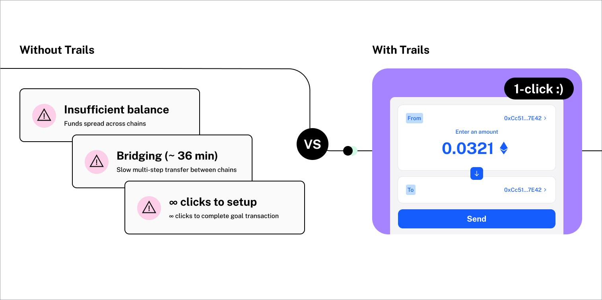

## Trails Starter (React + Vite)

A minimal starter showcasing Trails SDK flows in React: Fund, Pay, Swap, and Earn. It uses modern EVM tooling (Viem + Wagmi + RainbowKit), TanStack Query, Tailwind CSS, and radix components.

## What is Trails?

The onchain transaction rails for every token from every chain with every wallet with one, aggregated balance. Trails automatically detects and orchestrates the necessary steps in order to execute any cross-chain transaction with any token by swapping, bridging, and calling any arbitrary function. Integrate in seconds with only a few lines of code.



## Quickstart

### 1) Clone

```bash
git clone https://github.com/0xsequence-demos/trails-starter.git trails-starter && cd trails-starter
```

### 2) Install

```bash
pnpm i
# or: npm i  |  yarn
```

### 3) Optional: Configure environment

Copy the `.env.example` to `.env` file in the project root:

```env
# Request an access key at https://t.me/build_with_trails
VITE_TRAILS_API_KEY="ADD_API_KEY_HERE"
# Optional walletconnect ID if you'd like walletconnect support, retrieved from https://cloud.walletconnect.com/.
VITE_WALLETCONNECT_PROJECT_ID=
```


### 4) Start the dev server

```bash
pnpm dev
# or: npm run dev  |  yarn dev
```

Open `http://localhost:5173`.

Each widget uses the same underlying `TrailsWidget` and differs by `mode` and a few props. See `components/trails/*.tsx` for concrete usage for each and UX flows.

## TrailsProvider & Hooks

This starter includes the `TrailsProvider` configured in `components/Providers.tsx`, which enables the use of Trails hooks throughout your app:

```tsx
<TrailsProvider
  config={{
    trailsApiKey: import.meta.env.VITE_TRAILS_API_KEY ?? "",
    // Optional: Custom API endpoints
    // trailsApiUrl: "...",
    // sequenceIndexerUrl: "...",
    // sequenceNodeGatewayUrl: "..."
  }}
>
  <App />
</TrailsProvider>
```

### Example: Token Balances Hook

See `components/trails/TokenBalancesExample.tsx` for a complete example using the `useTokenBalances` and `useAccountTotalBalanceUsd` hooks. This component:

- Fetches all token balances across chains for the connected wallet
- Displays total balance in USD
- Shows individual token balances with logos and USD values

Available hooks include:
- `useTokenBalances(address)` - Fetch sorted token balances enriched with USD price
- `useAccountTotalBalanceUsd(address)` - Get total USD balance across tokens
- `useQuote()` - Get real-time quotes for token swaps
- `useSupportedTokens()` - Fetch supported tokens list

For more hooks and details, see the [Trails Hooks documentation](https://docs.trails.build/sdk/hooks).

## Theming

- **Styling**: Each widget supports `customCss` variables (https://docs.trails.build/sdk/theming). Common tokens:
  - `--trails-border-radius-button`
  - `--trails-primary`, `--trails-primary-hover`
  - `--trails-text-inverse`
  - `--trails-focus-ring`

## Notes

- For advanced usage and prop reference, see the Trails docs (`https://docs.trails.build`)
- AI enabled wtih a `.cursorrules` file and MCP server for Cursor or Claude available [here](https://docs.trails.build/resources/llm-integration).
